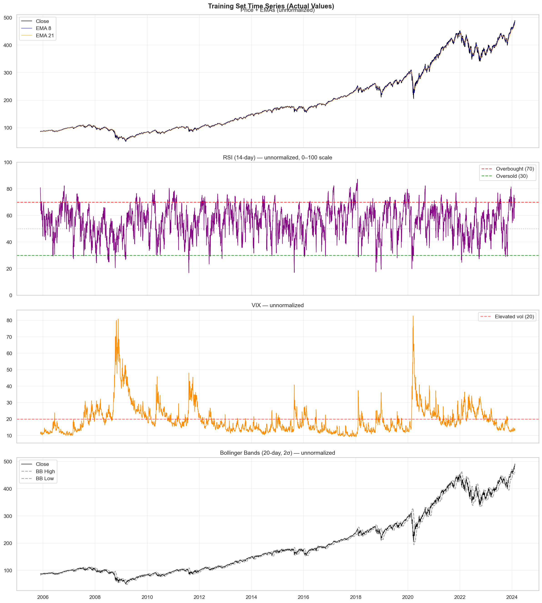
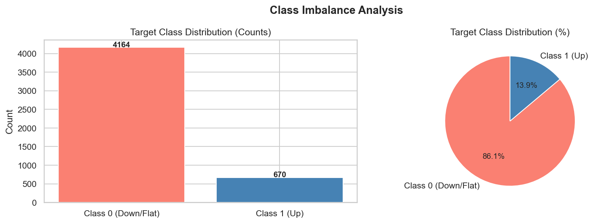
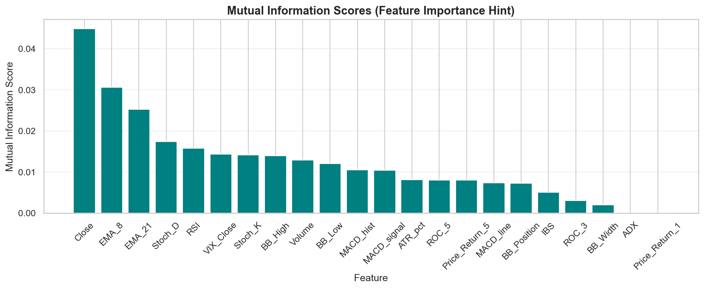
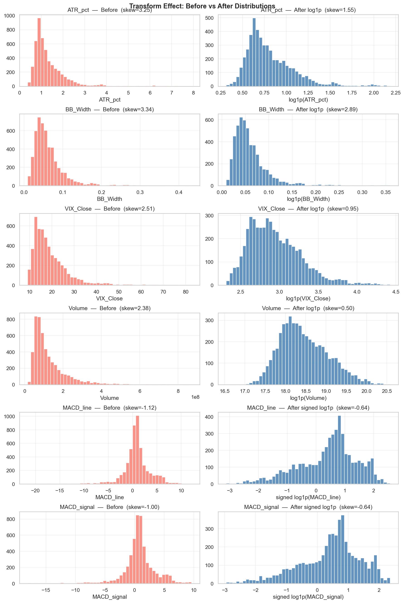
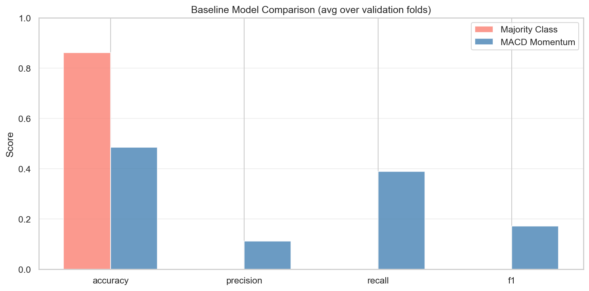
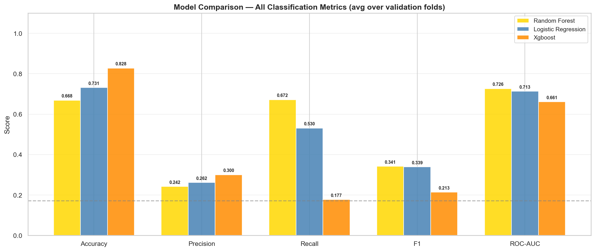
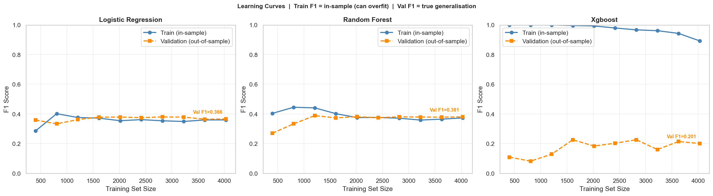
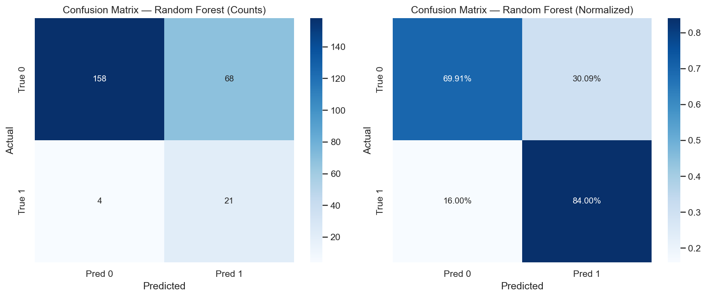
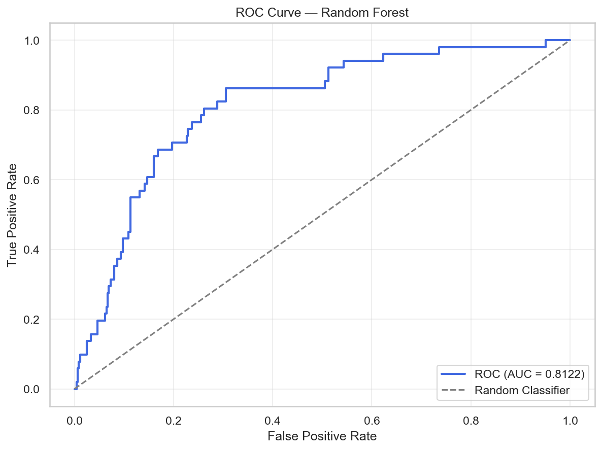
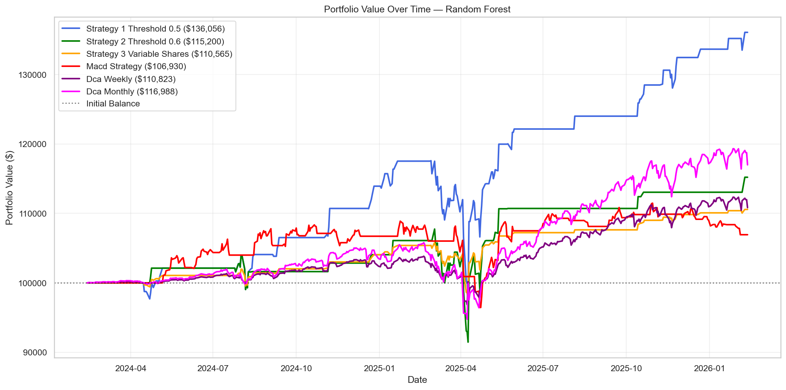

# Stock Return Classifier

A machine learning pipeline that predicts whether SPY (S&P 500 ETF) will gain **≥ 1% in a single trading day** and backtests trading strategies derived from those predictions.

---

## What This Project Does

**Task**: Binary classification — will SPY close ≥ 1% higher than today's close?

```
target[t] = 1  if  (Close[t+1] - Close[t]) / Close[t]  >=  1.0%
           = 0  otherwise
```

The pipeline covers the full ML lifecycle end-to-end:

1. **Data collection** — Downloads SPY (OHLCV, adjusted) and VIX from Yahoo Finance with local CSV caching and a 60-day warm-up buffer for indicator computation
2. **Feature engineering** — 22 technical indicators across momentum, trend, and volatility categories
3. **EDA** — Class balance, distributions, correlations, mutual information; outputs `eda_recommendations.json`
4. **Feature selection & transforms** — Applies EDA recommendations: log1p transforms for skewed features, drops redundant and low-signal features
5. **Temporal cross-validation** — Expanding window splits; no lookahead bias
6. **Normalization** — Rolling Z-score (63-day backward window) or StandardScaler fit on train only; binary features excluded
7. **Baseline models** — Majority-class and MACD momentum rule benchmarks
8. **Model training** — Logistic Regression, Random Forest, XGBoost with grid-search HPT on validation folds; best model re-fit on full training data
9. **Learning curves** — Train vs. validation score at 10%–100% training data sizes; held-out last val fold prevents leakage
10. **Test evaluation** — Confusion matrix, ROC curve, calibration curve, and portfolio backtesting on the held-out test period

---

## Results (spy_run)

**Best model**: Random Forest (selected via ROC-AUC tiebreak among 3 models within F1 ±0.05)
**Test period**: Feb 2024 – Feb 2026 (502 trading days)

| Metric | Validation | Test |
|--------|-----------|------|
| Precision | 0.280 | 0.307 |
| Recall | 0.531 | 0.686 |
| F1 | 0.347 | 0.424 |
| ROC-AUC | 0.722 | **0.812** |

**Portfolio simulation** (starting $100,000, 1-day hold):

| Strategy | Return | Final Value | Sharpe | Max Drawdown | Trades | Win Rate |
|----------|--------|-------------|--------|--------------|--------|----------|
| **Strategy 1** (prob > 0.5) | **+36.06%** | $136,056 | **1.099** | -16.24% | 114 | 64.0% |
| Strategy 2 (prob ≥ 0.6) | +15.20% | $115,200 | 0.486 | -15.10% | 63 | 63.5% |
| Strategy 3 (variable sizing) | +10.57% | $110,565 | 0.547 | **-7.57%** | 114 | 64.0% |
| MACD Strategy | +6.93% | $106,930 | 0.206 | -11.40% | 227 | 56.8% |
| DCA Weekly | +10.82% | $110,823 | 0.578 | -6.72% | 101 | 91.1% |
| DCA Monthly | +16.99% | $116,988 | 0.705 | -10.40% | 24 | 95.8% |

Strategy 1 outperforms all baselines on return and Sharpe ratio. Strategy 3 (variable sizing) achieves the lowest drawdown among ML strategies. All three ML strategies beat the MACD rule-based approach.

---

## Project Structure

```
stock-return-classifier/
├── config/
│   └── spy_run/                   # SPY 2006–present, 5-fold expanding CV, 2-year test
│       ├── data_config.json
│       └── model_config.json
├── notebooks/
│   ├── 01_data_collection.ipynb
│   ├── 02_data_preprocessing.ipynb
│   ├── 03_eda.ipynb
│   ├── 04_feature_engineering.ipynb
│   ├── 05_baseline_model.ipynb
│   ├── 06_ml_models.ipynb
│   └── 07_test_evaluation.ipynb
├── src/
│   ├── data/
│   │   ├── collector.py           # yfinance download + smart caching
│   │   └── splitter.py            # Temporal train/val/test splits
│   ├── features/
│   │   ├── engineer.py            # 22 technical indicators (ta library)
│   │   ├── target.py              # N-day forward return binary target
│   │   └── normalizer.py          # Rolling or standard Z-score normalization
│   ├── models/
│   │   ├── trainer.py             # Grid-search HPT + model training
│   │   └── validator.py           # Learning curves (leakage-free)
│   ├── evaluation/
│   │   ├── metrics.py             # Classification metrics + plots
│   │   └── portfolio.py           # Portfolio simulation (3 ML strategies + baselines)
│   └── utils/
│       └── config_loader.py       # JSON config with dot-notation access
├── data/                          # Auto-created: raw/ and processed/{project}/
├── models/                        # Saved .pkl model files
├── results/                       # Plots (.png), metrics (.json), trades (.csv)
├── figs/                          # Committed figures for README
├── requirements.txt
└── CONFIG_PARAMETERS.md
```

---

## Quick Start

### 1. Install dependencies

```bash
pip install -r requirements.txt
```

### 2. Run the pipeline

Open notebooks in order. Set `PROJECT_FOLDER` at the top of each notebook:

```python
PROJECT_FOLDER = "spy_run"
```

| # | Notebook | Output |
|---|----------|--------|
| 01 | `01_data_collection.ipynb` | `data/raw/{project}_raw.parquet` |
| 02 | `02_data_preprocessing.ipynb` | 22 features added, binary target created, temporal splits, normalization |
| 03 | `03_eda.ipynb` | Distribution plots, correlations, MI scores → `eda_recommendations.json` |
| 04 | `04_feature_engineering.ipynb` | Log1p transforms applied, redundant/low-signal features dropped → `data/processed/{project}/` |
| 05 | `05_baseline_model.ipynb` | Majority-class and MACD momentum benchmarks |
| 06 | `06_ml_models.ipynb` | HPT, learning curves, model selection, `models/{project}/best_model.pkl` |
| 07 | `07_test_evaluation.ipynb` | Confusion matrix, ROC curve, calibration, portfolio simulation |

Each notebook is standalone — it reads from files saved by the previous stage.

---

## Pipeline Walkthrough

### Stage 1–2: Data Collection & Feature Engineering

SPY OHLCV and VIX are downloaded via yfinance and combined. 22 technical indicators are computed covering price momentum, trend strength, volatility, and market regime.



*The time series plot shows SPY adjusted close alongside key indicators computed from 2006 to present. The price action, Bollinger Bands, RSI, and VIX are plotted together to visualise how market conditions vary across the full training history. Periods of high VIX correspond to increased volatility and potential ≥1% day frequency.*

---

### Stage 3: Exploratory Data Analysis

#### Class Distribution



*The target class is highly imbalanced — only ~13.7% of trading days produce a ≥1% SPY gain (class 1). The remaining ~86.3% are flat or negative days (class 0). This imbalance directly informed the choice of F1 as the HPT metric and `class_weight="balanced"` / `scale_pos_weight` for all three models to prevent them from defaulting to "never buy".*

#### Feature Signal Strength (Mutual Information)



*Mutual information measures the statistical dependence between each feature and the binary target, independent of linear assumptions. Higher scores indicate more predictive signal. This chart, combined with Pearson correlation, drives the feature dropping decisions applied in the next stage — features with near-zero MI and near-zero linear correlation are candidates for removal.*

---

### Stage 4: Feature Engineering

#### Log1p Transforms



*Several features (e.g. Volume, BB_Width, ATR_pct) have heavy right-skewed distributions that reduce model effectiveness. The EDA notebook identifies these via skewness scores and writes them to `eda_recommendations.json`. This notebook applies `log1p` transforms (or `sign(x) * log1p(|x|)` for signed oscillators like MACD) and shows before/after distributions — skewness drops significantly for affected features.*

---

### Stage 5: Baseline Models



*Two baselines are evaluated across all validation folds: (1) majority-class classifier — predicts 0 every day, achieving ~86% accuracy but F1=0 since it never identifies a buy signal; (2) MACD momentum rule — predicts 1 when MACD histogram > 0, achieving F1≈0.18 with high recall but poor precision (0.12). These set the minimum bar that all ML models must clear to be considered useful.*

---

### Stage 6: ML Models

#### Model Comparison



*After hyperparameter tuning via grid search, all three models are evaluated on honest cross-validation (train on each fold's training split, evaluate on its held-out validation split). All models achieve similar F1 scores within a 0.05 tolerance band. When models are this close in F1, the selection logic breaks ties by ROC-AUC — Random Forest is selected with the highest ROC-AUC (0.722).*

#### Learning Curves



*Learning curves show train and validation F1 as the training set size increases from 10% to 100%. A large gap between train and val indicates overfitting; val scores still rising at 100% suggest more data would help. Random Forest shows the characteristic pattern of tree-based models — high train F1 at small sizes (memorisation) that converges as data grows. Logistic Regression shows a smaller gap, indicating lower variance but also lower capacity.*

---

### Stage 7: Test Evaluation

#### Confusion Matrix



*The confusion matrix (left: raw counts, right: row-normalised percentages) shows performance on the held-out test set. The model correctly identifies ~69% of actual Up days (high recall) with 30.7% precision. The normalised view makes the class-level error rates directly comparable despite the imbalance.*

#### ROC Curve



*The ROC curve plots the true positive rate against the false positive rate across all probability thresholds. An AUC of 0.812 on the test set (vs 0.722 at validation) indicates strong probability ranking — the model places genuine Up days above Down days ~81% of the time. This matters especially for the confidence-threshold strategies, where the quality of the probability score directly controls which signals are acted on.*

#### Portfolio Value Over Time



*All strategies start at $100,000 and are tracked daily across the test period. Strategy 1 (full balance on any signal, prob > 0.5) dominates with +36.06% return and the highest Sharpe ratio (1.099). All three ML strategies outperform the MACD rule-based approach (+6.93%). DCA Monthly provides a strong passive baseline (+16.99%) but Strategy 1 still exceeds it by a wide margin. Strategy 3 (variable sizing) achieves the lowest max drawdown (-7.57%) among ML strategies, offering a risk-conscious alternative.*

---

## Model Selection Logic

Best model selection uses a two-stage process:

1. **F1 dominance check**: If one model leads all others by > 0.05 in F1, it is selected outright
2. **ROC-AUC tiebreak**: If multiple models fall within the 0.05 F1 tolerance band, the one with the highest ROC-AUC is selected

This prevents selecting a model with marginally higher F1 but worse probability ranking, which matters for confidence-threshold portfolio strategies.

---

## Configuration

Two JSON files control every experiment. Switch configs by changing `PROJECT_FOLDER`.

### `data_config.json`

| Parameter | spy_run |
|-----------|---------|
| `ticker` | SPY |
| `start_date` | 2006-01-01 |
| `end_date` | auto (yesterday) |
| `target.horizon_days` | 1 |
| `target.return_threshold_pct` | 1.0 |
| `data.normalization` | rolling |
| `data.normalization_window` | 63 |
| `split.test_years` | 2 |
| `split.n_folds` | 5 |

### `model_config.json`

| Parameter | Value |
|-----------|-------|
| `eval_metric` | f1 |
| `portfolio.initial_balance` | 100,000 |
| `portfolio.confidence_threshold` | 0.6 |

See **[CONFIG_PARAMETERS.md](CONFIG_PARAMETERS.md)** for the full parameter reference.

---

## Features (Pre-EDA)

22 technical indicators computed in `src/features/engineer.py`. The EDA notebook (03) recommends which features to log1p-transform and which to drop before training.

| Feature | Category | Description |
|---------|----------|-------------|
| `Close` | Price | SPY adjusted close (auto_adjust=True) |
| `Volume` | Volume | Daily share volume |
| `VIX_Close` | Macro | CBOE Volatility Index — market fear/regime |
| `BB_High`, `BB_Low` | Volatility | Bollinger Bands (20-day, 2σ) |
| `BB_Width` | Volatility | `(BB_High − BB_Low) / BB_Mid` — band squeeze |
| `BB_Position` | Volatility | `(Close − BB_Low) / (BB_High − BB_Low)` — price within band |
| `EMA_8`, `EMA_21` | Trend | Short and medium exponential moving averages |
| `ADX` | Trend strength | Average Directional Index (14-day) |
| `RSI` | Momentum | Relative Strength Index (14-day) |
| `MACD_line` | Momentum | 12/26 EMA difference |
| `MACD_signal` | Momentum | 9-day EMA of MACD line |
| `MACD_hist` | Momentum | MACD histogram (line − signal) |
| `Stoch_K` | Momentum | Stochastic %K (14-day) |
| `Stoch_D` | Momentum | Stochastic %D — 3-day smooth of %K |
| `ROC_3`, `ROC_5` | Momentum | 3-day and 5-day rate of change |
| `Price_Return_1`, `Price_Return_5` | Momentum | 1-day and 5-day percentage return |
| `IBS` | Momentum | Intra-Bar Strength: `(Close − Low) / (High − Low)` |
| `ATR_pct` | Volatility | ATR / Close × 100 — scale-invariant daily range |

All features use `auto_adjust=True` from yfinance, ensuring adjusted Close, High, and Low are consistent across splits and dividends.

---

## Models & Hyperparameter Tuning

Grid search over all hyperparameter combinations, averaged across validation folds, optimising F1. Best parameters are re-fit on the full training set before saving.

| Model | Tuned Parameters | Imbalance Handling |
|-------|-----------------|-------------------|
| Logistic Regression | `C` | `class_weight="balanced"` |
| Random Forest | `n_estimators`, `max_depth`, `min_samples_split` | `class_weight="balanced"` |
| XGBoost | `n_estimators`, `max_depth`, `learning_rate` | `scale_pos_weight` |

---

## Portfolio Strategies

### ML Strategies

All ML strategies use a **1-day hold** (sell at next day's close). Capital is fully deployed on each signal — position size = `int(balance / price)`.

| Strategy | Entry Condition | Position Size |
|----------|----------------|---------------|
| **Strategy 1** | `prob > 0.50` | Max affordable shares |
| **Strategy 2** | `prob ≥ 0.60` | Max affordable shares |
| **Strategy 3** | `prob ≥ 0.50` | Variable — scales with confidence (25/50/75/100% of max) |

**Strategy 3 sizing bins:**

| Probability | Position size |
|-------------|--------------|
| ≥ 0.875 | 100% |
| 0.75 – 0.875 | 75% |
| 0.625 – 0.75 | 50% |
| 0.50 – 0.625 | 25% |

### Baseline Strategies

| Strategy | Description |
|----------|-------------|
| **MACD Strategy** | Buy max shares when MACD histogram > 0, sell 1 day later (same hold period as ML strategies) |
| **DCA Weekly** | Split $100K into equal portions, buy every 5 trading days, hold until end |
| **DCA Monthly** | Split $100K into equal portions, buy every 21 trading days, hold until end |

DCA strategies are pure accumulation (no selling between intervals) and provide a passive investment baseline for comparison.

Reported per strategy: final value, total return %, Sharpe ratio, max drawdown, trade count, win rate.

---

## Validation Design

- **Expanding window** (default): each fold's training set grows by one time block — simulates deploying a model that retrains on all available history
- **Sliding window**: fixed-size training window shifts forward — simulates a model retrained on a recent rolling window
- **Learning curves**: the last val fold is held out as a fixed evaluation set at all training sizes, preventing progressive leakage as the training pool grows

---

## License

MIT
